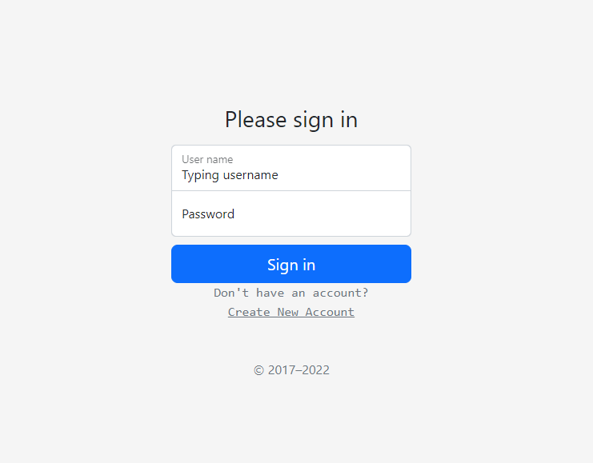
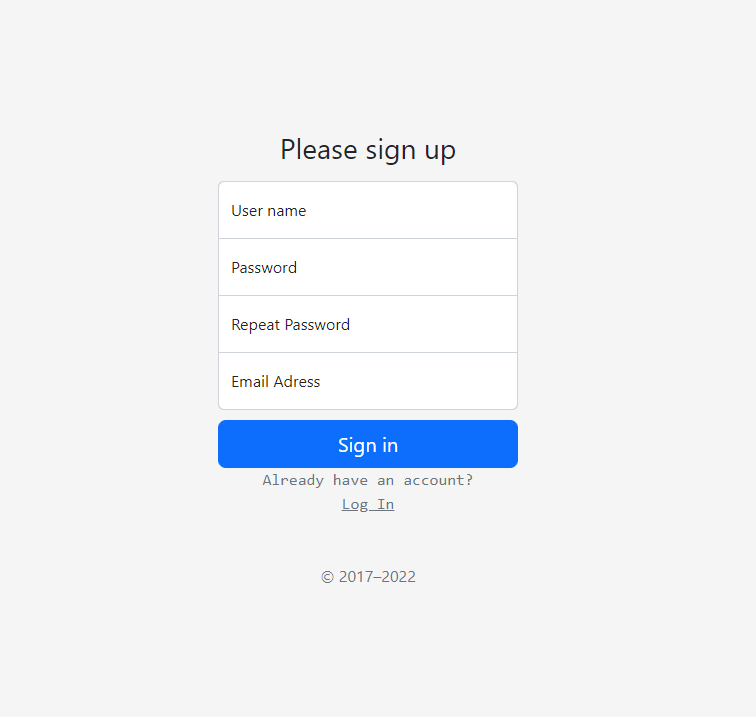
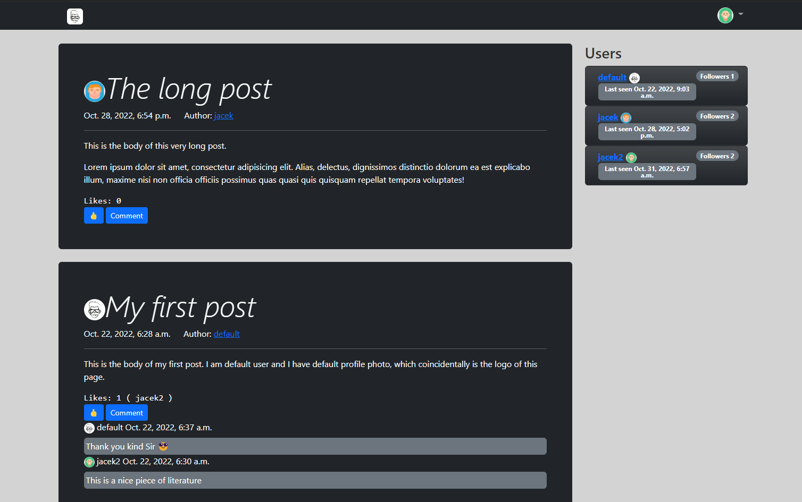
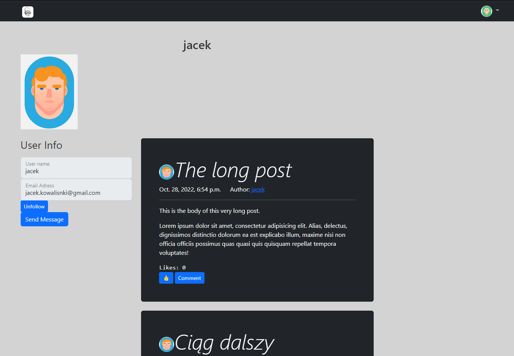
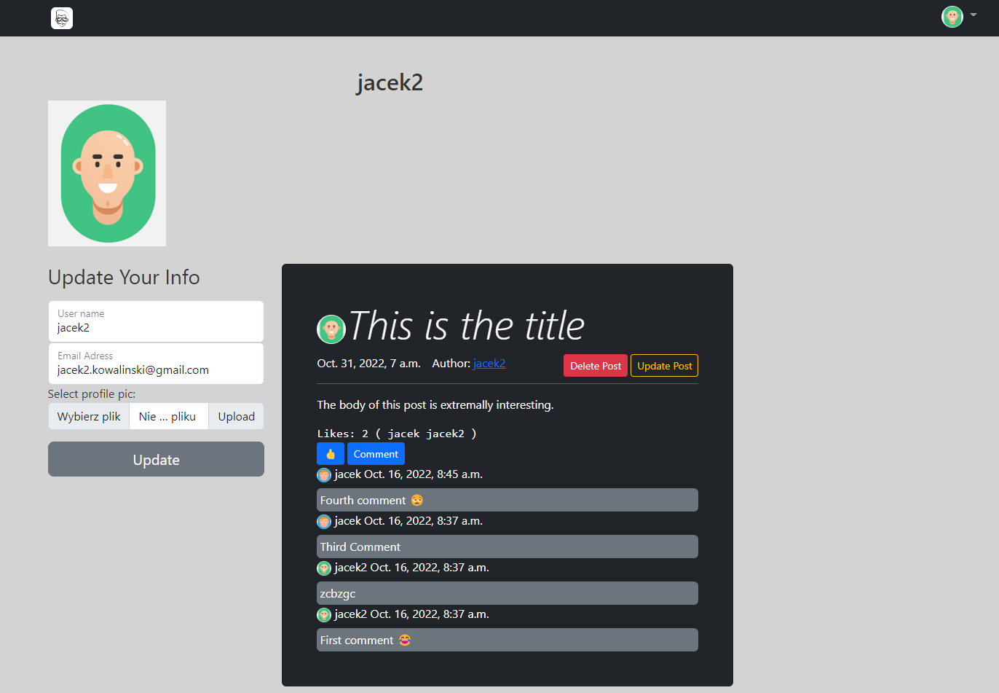
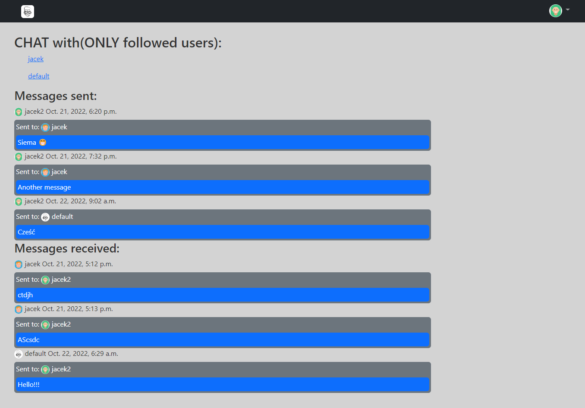

# Social Network site using Django framework

## Screenshots

| Log In | Sign up | Main page |
| -------|--------------|-----------------|
|  |  |  |

| Other user profile | Logged in user profile| Simple messages |
| ---------------|------------------|-----------------|
|  |  |  |

## Functionality

- Posts: Add, update, delete
- CustomUser(AbstractUser): Add, update, delete
- Log in, log out
- Posts likes, comments
- Follow users(contents of the main page filtered on that basis)
- Pagination
- Simple messages
- Tests for every view(pytest-django)

## Installing

### Clone the project

```
git clone https://github.com/JacekKowal/TheBook.git
```

### Install dependencies & activate virtualenv

```
pip install pipenv

pipenv install
pipenv shell
```

### Configure the settings (connection to the databasee)

1. Edit `TheBook/settings.py` for database settings.

### Apply migrations

```
python TheBook/manage.py migrate
```

### Running a development server

```
python TheBook/manage.py runserver
```
